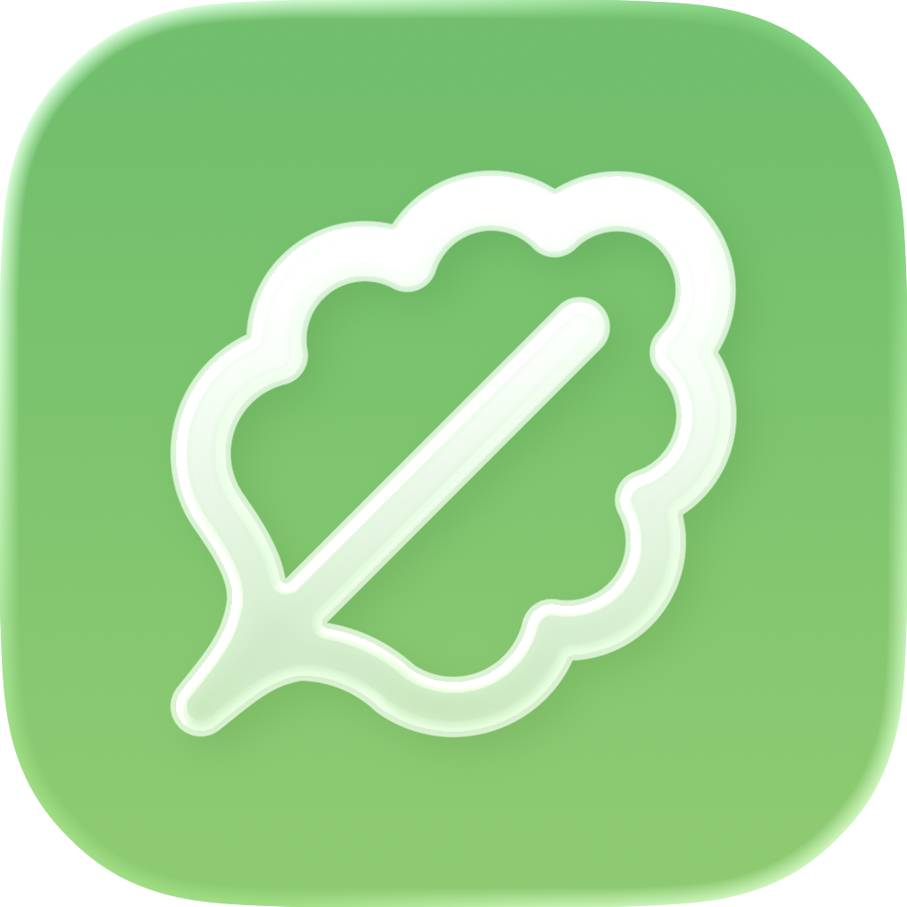

# GoodFind  

## Inspiration

Food insecurity is often framed as a scarcity problem, but in cities like Los Angeles, the food exists. Food banks, farmers markets, community gardens, and grocery deals are scattered across every neighborhood. The real problem is visibility. People default to fast food not because they want to, but because they don't know what's nearby, what's on sale, or when a pantry is open. We wanted to build something that turns scattered local knowledge into a shared, living resource, so that the better choice is always the obvious one.

## What it does

GoodFind is an app centered around a community-powered map where users can:

- Drop pins on food banks, grocery stores, farmers markets, community gardens, pantries, etc.
- Attach deals to pins with titles, descriptions, and schedules (days + times + expiry)
- Save pins they visit often
- Flag inaccurate or outdated pins and deals
- Filter the map by location type
- Earn badges for contributing consistently

## How we built it

1. Stack - Expo (React Native), Convex (backend + real-time), Clerk (auth), React Navigation, react-native-maps.
2. Data model - Users, pins (with coordinates and categories), deals (with schedules and expiry), and flags. Pins can be saved, reported, and filtered by type.
3. Features - Map with custom markers, add-pin flow (address search + form), pin detail modal, deals with schedules, badges, user profiles, blocking, and reporting.
4. UI - Bottom tabs (Map, Saved, Profile), modals and bottom sheets, dark mode, and a simple badge system for engagement.

## Challenges we ran into

1. Custom SVG pin icons didn't anchor to their tip correctly when zooming. The anchor prop was the problem since its X and Y coordinates where staying the same while zooming in and out, so we had to find a different way for the positioning of the markers. 
2. The transitions between Modals were getting messy, since the modals' positions were changing and the content was clipping.

## Accomplishments that we're proud of

- Built a fully functional, real-time crowdsourced map app in a single day
- Implemented a complete pin and deal system with scheduling, visibility controls, and flagging from scratch
- Seeded the app with real Los Angeles food resources so it feels useful from day one
- Designed a badge and reputation system that incentivizes healthy community contribution

## What we learned

- We cut several features to ship something complete and polished rather than something overbuilt and half-finished
- A real problem makes every decision easier, so because we were solving something concrete, every feature either served the mission or got cut

## What's next for GoodFind

GoodFind has a lot of space for growth, and here are some features we were thinking of adding:

- Opening hours - separate from deals, pins can have weekly hours so users know if a location is open right now.
- Push notifications - get alerted when a new deal is posted near you or on a pin you've saved.
- Moderation System for Admins - heavily flagged pins/deals get auto-hidden pending review by admins instead of staying visible indefinitely.
- Pin gallery - anyone can add photos to a public pin so people have a real visual of the place before they go, making pins more reliable and trustworthy.

